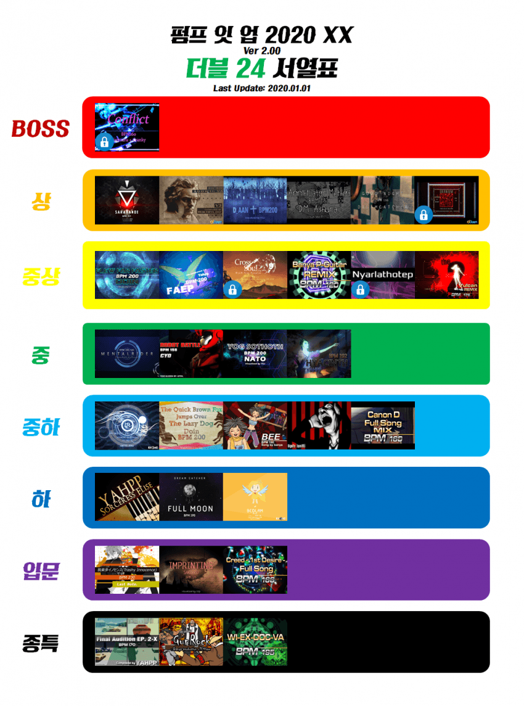

# peeyouweb: Pump It Up Tier List

As the telegram bot, <a href="https://github.com/wfxronald/peeyoubot">peeyoubot</a>, collects data from the user, we can make use of the list of clears for analysis purposes. Assuming that user tracks their clear in order (as they use the app while they play and regularly key in their clears immediately after they achieved a clear), we will be able to see a pattern in the order most people clear charts of a particular level. For example, if most people pass WI-EX-DOC-VA D24 first, it means that WI-EX-DOC-VA is a relatively easier 24 in the folder.

This idea of tracking the clear order is inspired by the idea of Clear Rate in another rhythm game, Beatmania IIDX. As a result, we can collectively generate a tier-list of the level given enough data sample.

<em>A sample tier-list, credits to DCInside: A Korean Pump It Up Community Forum</em>

Indeed there has been many tier-list circulating around the Internet, and since it is made by an individual, it might be biased towards certain charts and the resulting tier-list might be subjective. Therefore, peeyouweb tries to tackle this limitation by sourcing for actual player data to support the tier-listing.

The website obtains all title cards of the songs from <a href="https://pumpout2020.anyhowstep.com/">PumpOut</a>, a database containing the most recent Pump It Up songs and charts.

## Skills learnt
- Django (Python)
- PostgreSQL
- Deployment on Heroku
